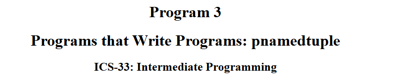

After hearing DHH talk about how [Ruby's metaprogramming expanded his mind](https://youtu.be/mTa2d3OLXhg?si=7wkc66P-9Dk0BFjX&t=84), it resonated with my early experiences with Python. I will admit that at this point in my programming journey, Python feels somewhat lukewarm and pales in comparison to some of the other languages that are 'shinier' and align better with the style of programming that I've developed over time (enter Gleam, Elixir, Golang, etc.). But I would be remiss not to give Guido van Rossum's language my gratitude for what its given me.

<!-- 
*DHH on the TopShelf, where he talks about his programming journey.* -->

## Java: Hello world

I should start at the very beginning, because everything that preceded Python was the perfect kind of trajectory for me to appreciate the language. My first experience with programming[^1] was in highschool:

AP Computer Science A, an introductory course for Java programming.

It was me and a couple of friends who enrolled in this single-digit headcount class[^2], and what soon came was starting up our BlueJ editors and encountering our very first `Hello world`'s. This alone felt pretty good to me already -- I was excited to dive in and explore what lied behind this simple program, looking at the console output as if it were the small door in Alice in Wonderland.

*"Hello world!", says the little talking doorknob.*

But the more I think back, I remember a feeling very vividly.

### `public static void main`

Huh?

### `System.out.println`

What?

I know that the code snippet shown in the book is going to write some words on the screen, but... **what *is* all this stuff**?

At the time, I couldn't wrap my head around why we had to write things out in a certain way. I was confused. I really wanted to understand the semantics behind the syntax but I just ended up compartmentalizing my confusion -- I just shifted my focus on instead trying to learn what I could. As a result, I passed the class, but a lot of concepts felt blurry to me. Was it always going to be this way?

---

## Hello world, again

Two years pass. The COVID-19 quarantine was still in full effect. I've enrolled at UCI as an undeclared undergrad and couldn't get admitted to the intro computer science class for two straight quarters. In these two years, I've written not one line of code. Java syntax was still floating somewhere in the back of my head, but I never would have thought that the next time I get to write Java would be after half a decade.

During spring quarter, I've finally been enrolled into ICS 31: Intro to Python Programming. At this point, I was just happy to be able to finally do some coding again, and that gave me some wind in my sails. Upon starting this coursework, it was not long before I started to feel how much *nicer* it felt to write Python. The class had us learn using zyBooks, where Python's concise syntax was shown to me in little fun-sized animations. Didn't take long for me to buy into this shiny new Python and turn my back on that esoteric Java syntax. And that's exactly what I did for a while.

*These walkthrough animations were great.*

For the duration of ICS 31 and ICS 32, programming was pretty fun. These classes gently tugged me along a tour of the little intricacies of Python programming. But where things got shaken up for me was ICS 33, taught by Richard Pattis, which appeared to be a polarizing name given what people have said in the UCI ICS Discord server. But alas, my Python learnings continued.

Nothing interesting happened for a while. Lectures were optional, so all I was really doing was reading the material and chugging along.

But then week 6 happened.

[*pnamedtuple, a project publicly accessible on his plain HTML site.*](https://ics.uci.edu/~pattis/ICS-33/index.html)

This project flipped a switch in my brain. I already understood that writing programs by hand can result in making really powerful programs, but being introduced to metaprogramming was such an epiphany. I was really hoping that the rest of the coursework was **only** metaprogramming (it wasn't). Learning that you can introspect code and execute code strings felt orders of magnitude more fascinating and powerful than everything else I've seen, and I was really hoping to see what cool things we could accomplish with this stuff.

However, my Python journey actually stops there. ICS 45C grabbed me by the collar to tell me all about C++. I was left with this unrequited feeling of wanting to do metaprogramming and also just going as deep as possible into one single language to find any other holy grails that Python was hiding from me.

One of the main reasons why I had this kind of feeling can be attributed to the way that Python was designed, a design concept perfectly encapsulated by a term Chris Lattner said in a talk: **Progressive Disclosure of Complexity**. The beauty of Python and Ruby is that they are simple to start with, but empowers users with more advanced features if they continue to dig into the language. Designing a language that *progressively discloses complexity* makes for an elegant language that rewards curiosity, and allows for these *a-ha* moments that have made a positive impact on me, DHH, and *hopefully* most other programmers.

[^1]: Technically my first experience with programming was one of those old PBS Kids Flash games. I think it was an Arthur game where you had to program an itinerary for a bike ride that traversed a 2d grid while only having limited moves or something. It was kind of fun.

[^2]: Looking back, I think being among friends in a laid-back and quiet class helped create an environment where I could focus purely on learning and not have to worry about the outside world as much.
